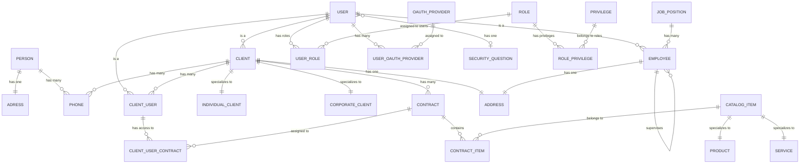

```mermaid
erDiagram
    PERSON ||--|| ADRESS : "has one"
    PERSON ||--o{ PHONE: "has many" 
    
    USER ||--o{ CLIENT : "is a"
    USER ||--o{ CLIENT_USER : "is a"
    USER ||--o{ EMPLOYEE : "is a"
    USER ||--o{ USER_ROLE : "has roles"
    USER ||--o{ USER_OAUTH_PROVIDER: "has many"
    USER }o--o| SECURITY_QUESTION: "has one" 

    OAUTH_PROVIDER ||--o{ USER_OAUTH_PROVIDER: "assigned to"

    CLIENT ||--|| INDIVIDUAL_CLIENT : "specializes to"
    CLIENT ||--|| CORPORATE_CLIENT : "specializes to"
    CLIENT ||--o{ CLIENT_USER : "has many"
    CLIENT_USER ||--o{ CLIENT_USER_CONTRACT : "has access to"
    CLIENT ||--o{ CONTRACT : "has many"
    CLIENT ||--|| ADDRESS : "has one"
    CLIENT ||--o{ PHONE : "has many"

    CONTRACT ||--o{ CONTRACT_ITEM : "contains"
    CONTRACT ||--o{ CLIENT_USER_CONTRACT : "assigned to"

    CATALOG_ITEM ||--o{ CONTRACT_ITEM : "belongs to"
    CATALOG_ITEM ||--|| PRODUCT : "specializes to"
    CATALOG_ITEM ||--|| SERVICE : "specializes to"
 
    ROLE ||--o{ USER_ROLE : "assigned to users"
    ROLE ||--o{ ROLE_PRIVILEGE : "has privileges"
    
    PRIVILEGE ||--o{ ROLE_PRIVILEGE : "belongs to roles"

    EMPLOYEE ||--o{ EMPLOYEE : "supervises"
    EMPLOYEE ||--|| ADDRESS : "has one"

    JOB_POSITION ||--o{ EMPLOYEE : "has many"
```