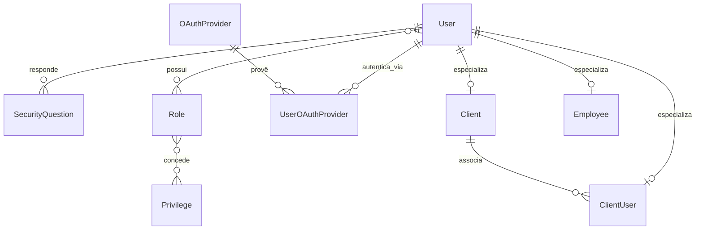
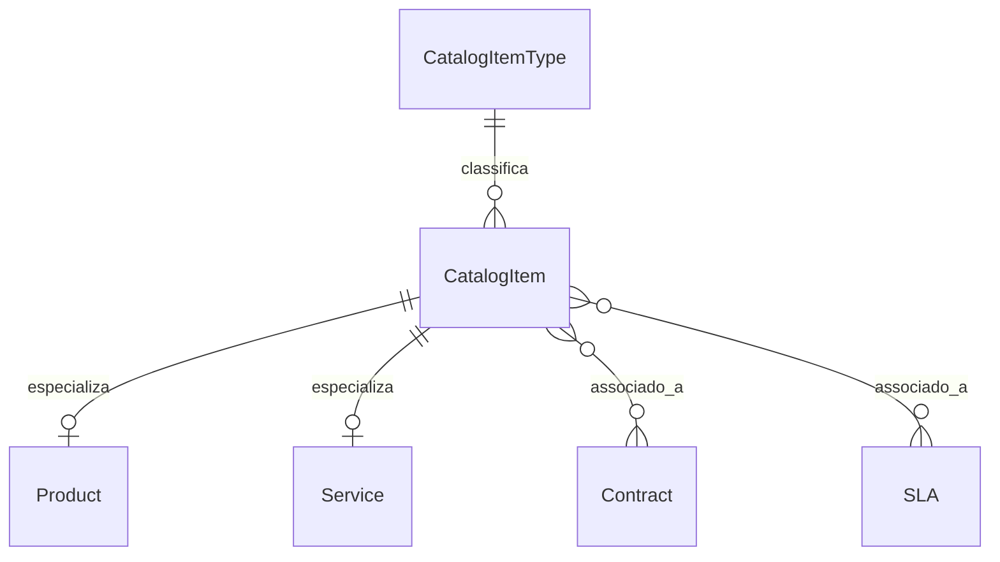

# Documentação de Modelagem Relacional de Banco de Dados

## Versões

| Data       | Versão | Descrição                  | Responsáveis               |
|------------|--------|----------------------------|----------------------------|
| 28/06/2025 | 0.1    | Criação do documento       | [Maelton Lima dos Santos](https://github.com/Maelton) |
| 30/06/2025 | 0.2    | Adiciona estrutura do documento | [Maelton Lima dos Santos](https://github.com/Maelton) |
| 30/06/2025 | 0.3    | Adiciona gerenciamento de autenticacao | [Maelton Lima dos Santos](https://github.com/Maelton) |
| 30/06/2025 | 0.4    | Adiciona gerenciamento de produtos | [Maelton Lima dos Santos](https://github.com/Maelton) |

## Descrição

Este documento apresenta a modelagem relacional do banco de dados do sistema BRISA Helpdesk, com o objetivo de descrever a estrutura lógica das tabelas, suas relações, restrições e propósitos dentro da aplicação.

Este documento será atualizado conforme novas entidades forem sendo adicionadas à base de dados e mudanças forem realizadas na estrutura existente.

## Modelagem Completa

<!-- IMAGEM DO MODELO RELACIONAL -->

## Principais Módulos da Aplicação

### Gerenciamento de Autenticação

#### Modelo Conceitual

#### Descrição

O módulo de Gerenciamento de Autenticação gerencia a autenticação e autorização de usuários no sistema BRISA Helpdesk. Ele suporta três tipos de usuários que podem fazer login: Client (clientes, especialização em tb_client), ClientUser (usuários vinculados a clientes, especialização em tb_client_user), e Employee (funcionários, especialização em tb_employee). 

O módulo inclui a gestão de credenciais de login, perguntas de segurança para recuperação de contas, papéis (roles) e privilégios para controle de acesso, além de suporte a autenticação via provedores OAuth2/OpenID Connect. Este módulo assegura acesso seguro e controlado às funcionalidades do sistema, com suporte a associações de papéis e permissões, bem como integração com provedores externos de autenticação.

As principais entidades incluem:

- **Usuários (tb_user)**: Armazena informações de autenticação dos usuários (Client, ClientUser, Employee), como nome de usuário, hash de senha e status da conta.
- **Perguntas de Segurança (tb_security_question)**: Contém perguntas usadas para recuperação de contas, associadas a respostas criptografadas por usuário.
- **Papéis (tb_role)**: Define os papéis do sistema que determinam níveis de acesso.
- **Privilégios (tb_privilege)**: Armazena permissões atômicas associadas a papéis.
- **Provedores OAuth (tb_oauth_provider)**: Configurações para autenticação via provedores externos, como Google ou Microsoft.
- **Associações de Usuários com Provedores OAuth (tb_user_oauth_provider)**: Relaciona usuários a contas externas de autenticação.
- **Relações M:N**: Incluem associações entre usuários e papéis (tb_user_role) e entre papéis e privilégios (tb_role_privilege).
- **Tipos de Usuários**:
    - **Client**: Representa clientes (pessoa física ou jurídica) registrados em tb_client.
    - **ClientUser**: Usuários vinculados a clientes, registrados em tb_client_user, com login próprio por cliente.
    - **Employee**: Funcionários da empresa, registrados em tb_employee.

#### Modelo Relacional

### Gerenciamento de Produtos

#### Modelo Conceitual

#### Descrição

O módulo de Gerenciamento de Produtos é responsável por gerenciar os itens do catálogo do sistema BRISA Helpdesk, que incluem produtos e serviços oferecidos aos clientes. Ele organiza os itens do catálogo em tipos específicos e permite a especialização em produtos (físicos ou não) e serviços (físicos ou não). 

Este módulo é essencial para associar itens do catálogo a contratos (por meio da tabela tb_contract_catalog_item) e a acordos de nível de serviço (SLAs, por meio da tabela tb_sla_catalog_item), garantindo que os serviços e produtos disponíveis sejam corretamente classificados, rastreados e vinculados às obrigações contratuais e de atendimento do sistema.

As principais entidades incluem:

- **CatalogItem (tb_catalog_item)**: Tabela base que armazena informações gerais sobre itens do catálogo, como produtos e serviços.
- **CatalogItemType (tb_catalog_item_type)**: Define os tipos de classificação para itens do catálogo (e.g., "Hardware", "Software", "Suporte Técnico").
- **Product (tb_product)**: Especialização de CatalogItem que representa produtos, com a distinção de serem físicos ou não.
- **Service (tb_service)**: Especialização de CatalogItem que representa serviços, com a distinção de serem físicos ou não.
- **Contract (tb_contract)**: Representa contratos associados a clientes, que podem incluir múltiplos itens do catálogo.
- **SLA (tb_sla)**: Define acordos de nível de serviço, que podem estar associados a itens do catálogo para especificar tempos de resposta e resolução.

#### Modelo Relacional

### Gerenciamento de Clientes

#### Modelo Conceitual
#### Descrição
#### Modelo Relacional

### Gerenciamento de Colaboradores

#### Modelo Conceitual
#### Descrição
#### Modelo Relacional

### Gerenciamento de Contratos

#### Modelo Conceitual
#### Descrição
#### Modelo Relacional

### Gerenciamento de SLAs

#### Modelo Conceitual
#### Descrição
#### Modelo Relacional

### Gerenciamento de Chamados

#### Modelo Conceitual
#### Descrição
#### Modelo Relacional

### Gerenciamento de Chats

#### Modelo Conceitual
#### Descrição
#### Modelo Relacional

### Gerenciamento de Base de Conhecimento

#### Modelo Conceitual
#### Descrição
#### Modelo Relacional

### Gerenciamento de Feedback

#### Modelo Conceitual
#### Descrição
#### Modelo Relacional

### Gerenciamento de Auditoria

#### Modelo Conceitual
#### Descrição
#### Modelo Relacional