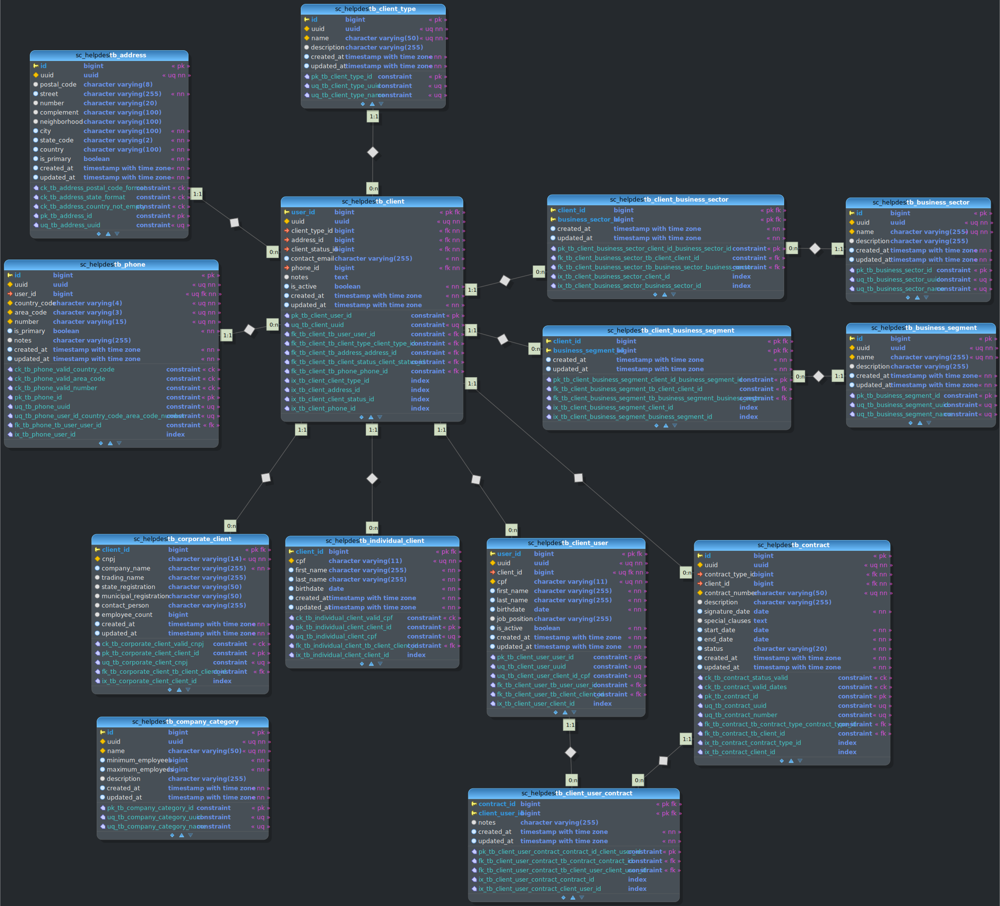

# Documentação de Modelagem Relacional de Banco de Dados

## Versões

| Data       | Versão | Descrição                  | Responsáveis               |
|------------|--------|----------------------------|----------------------------|
| 28/06/2025 | 0.1    | Criação do documento       | [Maelton Lima dos Santos](https://github.com/Maelton) |
| 30/06/2025 | 0.2    | Adiciona estrutura do documento | [Maelton Lima dos Santos](https://github.com/Maelton) |
| 30/06/2025 | 0.3    | Adiciona gerenciamento de autenticacao | [Maelton Lima dos Santos](https://github.com/Maelton) |
| 30/06/2025 | 0.4    | Adiciona gerenciamento de produtos | [Maelton Lima dos Santos](https://github.com/Maelton) |
| 30/06/2025 | 0.5    | Adiciona gerenciamento de clientes | [Maelton Lima dos Santos](https://github.com/Maelton) |
| 01/07/2025 | 0.6    | Adiciona gerenciamento de colaboradores | [Maelton Lima dos Santos](https://github.com/Maelton) |
| 01/07/2025 | 0.7    | Adiciona gerenciamento de contratos | [Maelton Lima dos Santos](https://github.com/Maelton) |
| 01/07/2025 | 0.8    | Adiciona gerenciamento de slas | [Maelton Lima dos Santos](https://github.com/Maelton) |

## Descrição

Este documento apresenta a modelagem relacional do banco de dados do sistema BRISA Helpdesk, com o objetivo de descrever a estrutura lógica das tabelas, suas relações, restrições e propósitos dentro da aplicação.

Este documento será atualizado conforme novas entidades forem sendo adicionadas à base de dados e mudanças forem realizadas na estrutura existente.

## Modelagem Completa

<!-- IMAGEM DO MODELO RELACIONAL -->

## Principais Módulos da Aplicação

### 1 Gerenciamento de Autenticação

#### 1.1 Modelo Conceitual

#### 1.2 Descrição

O módulo de Gerenciamento de Autenticação gerencia a autenticação e autorização de usuários no sistema BRISA Helpdesk. Ele suporta três tipos de usuários que podem fazer login: Client (clientes, especialização em tb_client), ClientUser (usuários vinculados a clientes, especialização em tb_client_user), e Employee (funcionários, especialização em tb_employee). 

O módulo inclui a gestão de credenciais de login, perguntas de segurança para recuperação de contas, papéis (roles) e privilégios para controle de acesso, além de suporte a autenticação via provedores OAuth2/OpenID Connect. Este módulo assegura acesso seguro e controlado às funcionalidades do sistema, com suporte a associações de papéis e permissões, bem como integração com provedores externos de autenticação.

As principais entidades incluem:

- **Usuários (tb_user)**: Armazena informações de autenticação dos usuários (Client, ClientUser, Employee), como nome de usuário, hash de senha e status da conta.
- **Perguntas de Segurança (tb_security_question)**: Contém perguntas usadas para recuperação de contas, associadas a respostas criptografadas por usuário.
- **Papéis (tb_role)**: Define os papéis do sistema que determinam níveis de acesso.
- **Privilégios (tb_privilege)**: Armazena permissões atômicas associadas a papéis.
- **Provedores OAuth (tb_oauth_provider)**: Configurações para autenticação via provedores externos, como Google ou Microsoft.
- **Associações de Usuários com Provedores OAuth (tb_user_oauth_provider)**: Relaciona usuários a contas externas de autenticação.
- **Relações M:N**: Incluem associações entre usuários e papéis (tb_user_role) e entre papéis e privilégios (tb_role_privilege).
- **Tipos de Usuários**:
    - **Client**: Representa clientes (pessoa física ou jurídica) registrados em tb_client.
    - **ClientUser**: Usuários vinculados a clientes, registrados em tb_client_user, com login próprio por cliente.
    - **Employee**: Funcionários da empresa, registrados em tb_employee.

#### 1.3 Modelo Relacional

### 2 Gerenciamento de Produtos

#### 2.1 Modelo Conceitual

#### 2.2 Descrição

O módulo de Gerenciamento de Produtos é responsável por gerenciar os itens do catálogo do sistema BRISA Helpdesk, que incluem produtos e serviços oferecidos aos clientes. Ele organiza os itens do catálogo em tipos específicos e permite a especialização em produtos (físicos ou não) e serviços (físicos ou não). 

Este módulo é essencial para associar itens do catálogo a contratos (por meio da tabela tb_contract_catalog_item) e a acordos de nível de serviço (SLAs, por meio da tabela tb_sla_catalog_item), garantindo que os serviços e produtos disponíveis sejam corretamente classificados, rastreados e vinculados às obrigações contratuais e de atendimento do sistema.

As principais entidades incluem:

- **CatalogItem (tb_catalog_item)**: Tabela base que armazena informações gerais sobre itens do catálogo, como produtos e serviços.
- **CatalogItemType (tb_catalog_item_type)**: Define os tipos de classificação para itens do catálogo (e.g., "Hardware", "Software", "Suporte Técnico").
- **Product (tb_product)**: Especialização de CatalogItem que representa produtos, com a distinção de serem físicos ou não.
- **Service (tb_service)**: Especialização de CatalogItem que representa serviços, com a distinção de serem físicos ou não.
- **Contract (tb_contract)**: Representa contratos associados a clientes, que podem incluir múltiplos itens do catálogo.
- **SLA (tb_sla)**: Define acordos de nível de serviço, que podem estar associados a itens do catálogo para especificar tempos de resposta e resolução.

#### 2.3 Modelo Relacional

### 3 Gerenciamento de Clientes

#### 3.1 Modelo Conceitual

#### 3.2 Descrição

O módulo de Gerenciamento de Clientes é responsável por gerenciar as informações dos clientes no sistema BRISA Helpdesk, incluindo pessoas físicas (tb_individual_client) e jurídicas (tb_corporate_client), bem como usuários vinculados a clientes (tb_client_user). Ele categoriza os clientes por tipo, status, setores de negócios e segmentos, além de associar endereços e números de telefone. 

Este módulo permite o rastreamento detalhado de informações de contato, classificações de clientes e suas associações com setores e segmentos de negócios, garantindo uma gestão eficiente das relações com os clientes.

As principais entidades incluem:

- **Client (tb_client)**: Tabela base para todos os clientes, vinculada a um usuário (tb_user) e associada a um tipo, status, endereço e telefone.
- **ClientType (tb_client_type)**: Define categorias de clientes (e.g., "Premium", "Standard").
- **ClientStatus (tb_client_status)**: Define os status possíveis para clientes (e.g., "Ativo", "Inativo").
- **IndividualClient (tb_individual_client)**: Especialização de Client para pessoas físicas, com informações como CPF e data de nascimento.
- **CorporateClient (tb_corporate_client)**: Especialização de Client para empresas, com informações como CNPJ e razão social.
- **Address (tb_address)**: Armazena informações de endereços físicos dos clientes.
- **Phone (tb_phone)**: Armazena números de telefone associados aos clientes.
- **ClientUser (tb_client_user)**: Representa usuários vinculados a clientes, com login próprio por cliente.
- **BusinessSector (tb_business_sector)**: Define setores de negócios (e.g., "Tecnologia", "Varejo") associados a clientes.
- **BusinessSegment (tb_business_segment)**: Define segmentos de negócios (e.g., "Software", "E-commerce") associados a clientes.
- **CompanyCategory (tb_company_category)**: Define categorias de empresas com base no tamanho (número de funcionários).

#### 3.3 Modelo Relacional

### 4 Gerenciamento de Colaboradores

#### 4.1 Modelo Conceitual

#### 4.2 Descrição

O módulo de Gerenciamento de Colaboradores é responsável por gerenciar as informações dos funcionários (employees) do sistema BRISA Helpdesk. Ele inclui detalhes sobre cargos, especializações, departamentos, filiais, status dos funcionários, horários de trabalho e informações de contato, como endereços e telefones. 

Este módulo permite o rastreamento de hierarquias (supervisores), alocação de cargos e especializações, associação a departamentos e filiais, bem como a definição de horários de trabalho semanais, garantindo uma gestão eficiente dos recursos humanos da organização.

As principais entidades incluem:

- **Employee (tb_employee)**: Tabela base para funcionários, vinculada a um usuário (tb_user) e associada a cargos, departamentos, filiais, status e informações de contato.
- **JobPosition (tb_job_position)**: Define os cargos disponíveis na organização (e.g., "Técnico de Suporte", "Gerente").
- **JobSpecialization (tb_job_specialization)**: Define especializações que podem ser associadas a cargos (e.g., "Redes", "Segurança").
- **Department (tb_department)**: Representa departamentos dentro da organização (e.g., "TI", "RH").
- **Branch (tb_branch)**: Representa filiais da empresa, cada uma associada a um endereço.
- **EmployeeStatus (tb_employee_status)**: Define os status possíveis para funcionários (e.g., "Ativo", "Demitido").
- **WorkSchedule (tb_work_schedule)**: Define horários de trabalho semanais (e.g., dias da semana e horários).
- **User (tb_user)**: Entidade de autenticação que Employee especializa, contendo credenciais de login.
- **Address (tb_address)**: Armazena endereços físicos associados a funcionários e filiais.
- **Phone (tb_phone)**: Armazena números de telefone associados aos funcionários.

#### 4.3 Modelo Relacional

### 5 Gerenciamento de Contratos

#### 5.1 Modelo Conceitual

#### 5.2 Descrição

O módulo de Gerenciamento de Contratos é responsável por gerenciar os contratos associados aos clientes no sistema BRISA Helpdesk. Ele permite a criação, rastreamento e categorização de contratos, vinculando-os a clientes, usuários relacionados aos clientes (ClientUsers), itens do catálogo (produtos ou serviços) e acordos de nível de serviço (SLAs). 

Este módulo assegura a gestão eficiente das obrigações contratuais, incluindo status, tipos de contratos, associações com itens do catálogo e SLAs, além de permitir que usuários vinculados a clientes (ClientUsers) sejam associados a contratos para facilitar a gestão de interações.

As principais entidades incluem:

- **Contract (tb_contract)**: Tabela base para contratos, associada a um cliente, tipo de contrato, status, itens do catálogo, SLAs e usuários vinculados a clientes.
- **ContractStatus (tb_contract_status)**: Define os status possíveis para contratos (e.g., "Ativo", "Cancelado").
- **ContractType (tb_contract_type)**: Define os tipos de contratos (e.g., "Manutenção", "Suporte").
- **Client (tb_client)**: Representa os clientes associados aos contratos.
- **ClientUser (tb_client_user)**: Representa usuários vinculados a clientes, que podem ser associados a contratos para gerenciar interações específicas.
- **CatalogItem (tb_catalog_item)**: Representa itens do catálogo (produtos ou serviços) vinculados aos contratos.
- **SLA (tb_sla)**: Define acordos de nível de serviço, associados a itens do catálogo vinculados a contratos.
- **ContractCatalogItem (tb_contract_catalog_item)**: Tabela de junção que associa contratos a itens do catálogo, permitindo múltiplos itens por contrato e múltiplos contratos por item.

#### 5.3 Modelo Relacional

### 6 Gerenciamento de SLAs

#### 6.1 Modelo Conceitual

#### 6.2 Descrição

O módulo de Gerenciamento de SLAs é responsável por gerenciar os Acordos de Nível de Serviço (SLAs) no sistema BRISA Helpdesk. Ele permite a criação, rastreamento e categorização de SLAs, que definem os tempos de resposta e resolução para serviços ou produtos associados a contratos, itens do catálogo ou tipos de chamados. 

Os SLAs são vinculados a itens do catálogo (produtos ou serviços), contratos (indiretamente via itens do catálogo), e tipos de chamados para especificar os compromissos de atendimento. Cada SLA é associada a um calendário (tb_calendar) que define os períodos de operação, e esses calendários podem ter exceções (tb_calendar_exception) para feriados ou eventos específicos. 

Este módulo assegura a gestão eficiente dos acordos de nível de serviço, incluindo status, prioridades (definidas na tabela tb_sla_priority), associações com itens do catálogo, contratos, tipos de chamados e calendários.

As principais entidades incluem:

- **SLA (tb_sla)**: Tabela base para acordos de nível de serviço, associada a um status, prioridade, itens do catálogo, tipos de chamados, contratos (via itens do catálogo) e calendário.
- **SLAPriority (tb_sla_priority)**: Define as prioridades de SLAs (e.g., "Alta", "Baixa"), anteriormente referida como tipo de SLA.
- **CatalogItem (tb_catalog_item)**: Representa itens do catálogo (produtos ou serviços) que pode ser associados aos SLAs.
- **Contract (tb_contract)**: Representa contratos associados a SLAs indiretamente via itens do catálogo ou que podem ser associados aos SLAs.
- **TicketType (tb_ticket_type)**: Define tipos de chamados (e.g., "Incidente", "Solicitação") que podem ser associados aos SLAs.
- **Calendar (tb_calendar)**: Define os períodos operacionais dos SLAs (e.g., horários de trabalho).
- **CalendarException (tb_calendar_exception)**: Define exceções nos calendários, como feriados ou eventos específicos.

#### 6.3 Modelo Relacional

### Gerenciamento de Chamados

#### Modelo Conceitual
#### Descrição
#### Modelo Relacional

### Gerenciamento de Chats

#### Modelo Conceitual
#### Descrição
#### Modelo Relacional

### Gerenciamento de Base de Conhecimento

#### Modelo Conceitual
#### Descrição
#### Modelo Relacional

### Gerenciamento de Feedback

#### Modelo Conceitual
#### Descrição
#### Modelo Relacional

### Gerenciamento de Auditoria

#### Modelo Conceitual
#### Descrição
#### Modelo Relacional