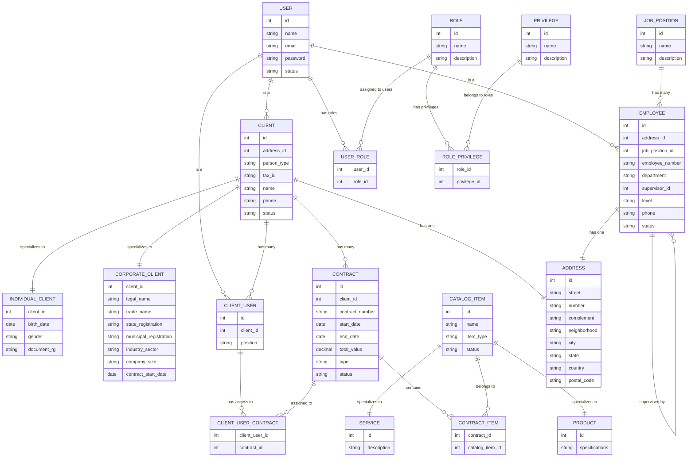

<!-- ```mermaid
erDiagram
    USER {
        int id
        string name
        string email
        string password
        string status
    }

    CLIENT {
        int id
        string person_type
        string tax_id
        string legal_name
        string trade_name
        string phone
        string address
        string industry_sector
        string company_size
        date contract_start_date
        string status
    }

    CLIENT_USER {
        int id
        int client_id
        string position
    }

    EMPLOYEE {
        int id
        string employee_number
        string department
        string job_title
        int supervisor_id
        string level
        string phone
        string status
    }

    CONTRACT {
        int id
        int client_id
        string contract_number
        date start_date
        date end_date
        decimal total_value
        string type
        string status
    }

    CATALOG_ITEM {
        int id
        string name
        string item_type
        string status
    }

    PRODUCT {
        int id
        string specifications
    }

    SERVICE {
        int id
        string description
    }

    CONTRACT_ITEM {
        int contract_id
        int catalog_item_id
    }

    ROLE {
        int id
        string name
        string description
    }

    PRIVILEGE {
        int id
        string name
        string description
    }

    USER_ROLE {
        int user_id
        int role_id
    }

    ROLE_PRIVILEGE {
        int role_id
        int privilege_id
    }

    CLIENT_USER_CONTRACT {
        int client_user_id
        int contract_id
    }

    USER ||--o{ CLIENT : "is a"
    USER ||--o{ CLIENT_USER : "is a"
    USER ||--o{ EMPLOYEE : "is a"
    CLIENT ||--o{ CONTRACT : "has many"
    CONTRACT ||--o{ CONTRACT_ITEM : "contains"
    CATALOG_ITEM ||--o{ CONTRACT_ITEM : "belongs to"
    CATALOG_ITEM ||--o{ PRODUCT : "is a"
    CATALOG_ITEM ||--o{ SERVICE : "is a"
    CLIENT ||--o{ CLIENT_USER : "has many"
    USER ||--o{ USER_ROLE : "has roles"
    ROLE ||--o{ USER_ROLE : "assigned to users"
    ROLE ||--o{ ROLE_PRIVILEGE : "has privileges"
    PRIVILEGE ||--o{ ROLE_PRIVILEGE : "belongs to roles"
    CLIENT_USER ||--o{ CLIENT_USER_CONTRACT : "access to"
    CONTRACT ||--o{ CLIENT_USER_CONTRACT : "assigned to"

``` -->

<!-- ```mermaid
erDiagram
    USER {
        int id
        string name
        string email
        string password
        string status
    }

    CLIENT {
        int id
        string person_type
        string tax_id
        string name
        string phone
        string address
        string status
    }

    INDIVIDUAL_CLIENT {
        int client_id
        date birth_date
        string gender
        string document_rg
    }

    CORPORATE_CLIENT {
        int client_id
        string legal_name
        string trade_name
        string state_registration
        string municipal_registration
        string industry_sector
        string company_size
        date contract_start_date
    }

    CLIENT_USER {
        int id
        int client_id
        string position
    }

    EMPLOYEE {
        int id
        string employee_number
        string department
        string job_title
        int supervisor_id
        string level
        string phone
        string status
    }

    CONTRACT {
        int id
        int client_id
        string contract_number
        date start_date
        date end_date
        decimal total_value
        string type
        string status
    }

    CATALOG_ITEM {
        int id
        string name
        string item_type
        string status
    }

    PRODUCT {
        int id
        string specifications
    }

    SERVICE {
        int id
        string description
    }

    CONTRACT_ITEM {
        int contract_id
        int catalog_item_id
    }

    CLIENT_USER_CONTRACT {
        int client_user_id
        int contract_id
    }

    ROLE {
        int id
        string name
        string description
    }

    PRIVILEGE {
        int id
        string name
        string description
    }

    USER_ROLE {
        int user_id
        int role_id
    }

    ROLE_PRIVILEGE {
        int role_id
        int privilege_id
    }

    USER ||--o{ CLIENT : "is a"
    USER ||--o{ CLIENT_USER : "is a"
    USER ||--o{ EMPLOYEE : "is a"
    CLIENT ||--|| INDIVIDUAL_CLIENT : "specializes to"
    CLIENT ||--|| CORPORATE_CLIENT : "specializes to"
    CLIENT ||--o{ CONTRACT : "has many"
    CONTRACT ||--o{ CONTRACT_ITEM : "contains"
    CATALOG_ITEM ||--o{ CONTRACT_ITEM : "belongs to"
    CATALOG_ITEM ||--|| PRODUCT : "specializes to"
    CATALOG_ITEM ||--|| SERVICE : "specializes to"
    CLIENT ||--o{ CLIENT_USER : "has many"
    CLIENT_USER ||--o{ CLIENT_USER_CONTRACT : "has access to"
    CONTRACT ||--o{ CLIENT_USER_CONTRACT : "assigned to"
    USER ||--o{ USER_ROLE : "has roles"
    ROLE ||--o{ USER_ROLE : "assigned to users"
    ROLE ||--o{ ROLE_PRIVILEGE : "has privileges"
    PRIVILEGE ||--o{ ROLE_PRIVILEGE : "belongs to roles"
    EMPLOYEE ||--o{ EMPLOYEE : "supervised by"

``` -->

<!-- ```mermaid
erDiagram
    USER {
        int id
        string name
        string email
        string password
        string status
    }

    CLIENT {
        int id
        string person_type
        string tax_id
        string name
        string phone
        string address
        string status
    }

    INDIVIDUAL_CLIENT {
        int client_id
        date birth_date
        string gender
        string document_rg
    }

    CORPORATE_CLIENT {
        int client_id
        string legal_name
        string trade_name
        string state_registration
        string municipal_registration
        string industry_sector
        string company_size
        date contract_start_date
    }

    CLIENT_USER {
        int id
        int client_id
        string position
    }

    JOB_POSITION {
        int id
        string name
        string description
    }

    EMPLOYEE {
        int id
        int job_position_id
        string employee_number
        string department
        int supervisor_id
        string level
        string phone
        string status
    }

    CONTRACT {
        int id
        int client_id
        string contract_number
        date start_date
        date end_date
        decimal total_value
        string type
        string status
    }

    CATALOG_ITEM {
        int id
        string name
        string item_type
        string status
    }

    PRODUCT {
        int id
        string specifications
    }

    SERVICE {
        int id
        string description
    }

    CONTRACT_ITEM {
        int contract_id
        int catalog_item_id
    }

    CLIENT_USER_CONTRACT {
        int client_user_id
        int contract_id
    }

    ROLE {
        int id
        string name
        string description
    }

    PRIVILEGE {
        int id
        string name
        string description
    }

    USER_ROLE {
        int user_id
        int role_id
    }

    ROLE_PRIVILEGE {
        int role_id
        int privilege_id
    }

    USER ||--o{ CLIENT : "is a"
    USER ||--o{ CLIENT_USER : "is a"
    USER ||--o{ EMPLOYEE : "is a"
    CLIENT ||--|| INDIVIDUAL_CLIENT : "specializes to"
    CLIENT ||--|| CORPORATE_CLIENT : "specializes to"
    CLIENT ||--o{ CONTRACT : "has many"
    CONTRACT ||--o{ CONTRACT_ITEM : "contains"
    CATALOG_ITEM ||--o{ CONTRACT_ITEM : "belongs to"
    CATALOG_ITEM ||--|| PRODUCT : "specializes to"
    CATALOG_ITEM ||--|| SERVICE : "specializes to"
    CLIENT ||--o{ CLIENT_USER : "has many"
    CLIENT_USER ||--o{ CLIENT_USER_CONTRACT : "has access to"
    CONTRACT ||--o{ CLIENT_USER_CONTRACT : "assigned to"
    USER ||--o{ USER_ROLE : "has roles"
    ROLE ||--o{ USER_ROLE : "assigned to users"
    ROLE ||--o{ ROLE_PRIVILEGE : "has privileges"
    PRIVILEGE ||--o{ ROLE_PRIVILEGE : "belongs to roles"
    EMPLOYEE ||--o{ EMPLOYEE : "supervised by"
    JOB_POSITION ||--o{ EMPLOYEE : "has many"
``` -->


